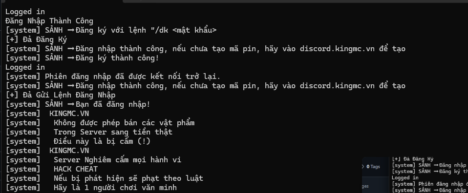
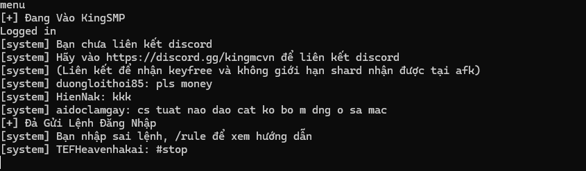

# 🤖 Minecraft Bot - Hướng Dẫn Sử Dụng (Dành Cho KingMC)

Bot được tối ưu riêng cho **KingMC**, giúp tự động đăng nhập, gửi TPA, AFK và thực hiện một số tác vụ cơ bản.

---

# ⚙️ Cấu Hình

Chỉnh sửa file `config.json` với thông tin mong muốn:

```json
{
    "username": "botname",
    "host": "kingsmp.vn",
    "port": "25565",
    "version": "1.21.1",
    "respawn": false,

    "registered": false,

    "botPassword": "password",
    "ownerUsername": "yourname"
}
```

## 📖 Giải Thích Các Thuộc Tính

| Thuộc tính      | Mô tả                                           |
| --------------- | ----------------------------------------------- |
| `username`      | Tên tài khoản của bot khi tham gia server.      |
| `host`          | IP hoặc tên miền của server Minecraft.          |
| `port`          | Cổng kết nối của server (mặc định `25565`).     |
| `version`       | Phiên bản Minecraft bot sử dụng để kết nối.     |
| `respawn`       | Bật/tắt tự động hồi sinh (`true` hoặc `false`). |
| `registered`    | Trạng thái tài khoản đã đăng ký hay chưa.       |
| `botPassword`   | Mật khẩu dùng để đăng ký/đăng nhập.             |
| `ownerUsername` | Chủ sở hữu bot, nhận TPA từ bot.                |

---

# 📝 Ví Dụ Cấu Hình

```json
{
    "username": "MinerBot",
    "host": "kingsmp.vn",
    "port": "25565",
    "version": "1.21.1",
    "respawn": true,

    "registered": true,

    "botPassword": "123456789",
    "ownerUsername": "Admin"
}
```

---

# 🚀 Chạy Bot

## 📦 Tải Bản EXE

Nếu không muốn cài NodeJS, bạn có thể dùng bản EXE đã đóng gói sẵn.

⚠️ Dung lượng khá lớn (~400MB) nhưng vẫn hỗ trợ chỉnh sửa `config.json`.

📥 Download:

https://www.mediafire.com/file/874bcwxcmjv7jmq/bot.exe/file

---

## 🔧 Cài Đặt Thư Viện

### 1️⃣ Cài NodeJS

Tải và cài đặt NodeJS trước khi chạy bot.

### 2️⃣ Cài Mineflayer

```bash
npm install mineflayer
```

---

## ▶️ Khởi Động Bot

```bash
node main.js
```

---

# 🔐 Đăng Ký & Đăng Nhập

## 🆕 Nếu `registered = false`

Lần đầu tham gia server, bot sẽ tự động đăng ký:

```text
/dk <botPassword>
```

Sau khi đăng ký thành công, bot sẽ tự động đổi:

```json
"registered": true
```

---

## 🔑 Nếu `registered = true`

Bot sẽ tự động đăng nhập bằng:

```text
/dk <botPassword>
```

---

# 💀 Tự Động Hồi Sinh

## ✅ Bật

```json
"respawn": true
```

Bot sẽ hồi sinh ngay lập tức khi chết.

## ❌ Tắt

```json
"respawn": false
```

Bot sẽ hồi sinh sau một khoảng thời gian ngẫu nhiên.

---

# 👑 Quyền Điều Khiển

Người dùng được chỉ định trong:

```json
"ownerUsername": "yourname"
```

sẽ là chủ sở hữu của bot.

Sau khi bot vào game thành công và thực hiện lệnh TPA, yêu cầu dịch chuyển sẽ được gửi đến tài khoản này.

---

# 🎮 Cách Sử Dụng Bot

Sau khi bot đăng nhập thành công:
ví dụ:



1. Chờ khoảng **5 giây**.
2. Trong Terminal nhập:

```text
menu
```

ví dụ vào sảnh kingsmp thành công


⚠️ Trong quá trình mở menu, bot có thể bị văng khá thường xuyên.

Nếu bị văng:

* Kết nối lại bot.
* Tiếp tục nhập:

```text
menu
```

cho đến khi vào được menu thành công.

---

## ✈️ Gửi TPA

Sau khi bot đã vào menu thành công:


```text
tpa
```

Bot sẽ tự động gửi TPA đến:

```json
"ownerUsername"
```

---

# 📜 Danh Sách Lệnh

| Lệnh   | Chức năng                       |
| ------ | ------------------------------- |
| `afk`  | Đưa bot vào trạng thái AFK.     |
| `wafk` | Bot xoay liên tục để tránh AFK. |
| `stop` | Dừng mọi hành động hiện tại.    |
| `exit` | Thoát khỏi server và tắt bot.   |

---

# ⚠️ Lưu Ý

* 🔒 Không chia sẻ `botPassword` cho người khác.
* 🌐 Nếu server thay đổi IP hoặc Port, hãy cập nhật lại file config.
* 👤 Nên sử dụng tài khoản phụ làm bot.
* 🎯 Bot được cấu hình riêng cho **KingMC**.
* ⚠️ Khi sử dụng ở server khác, một số tính năng có thể không hoạt động đúng hoặc hoạt động ngoài mong muốn.
* bot phải được setting trong KingSMP như sau: menu xác nhận lệnh tpa, tắt chat tổng KingMC

---

# 🆘 Hỗ Trợ

👤 Discord:

```text
made4mischief
```

Nếu bot không thể kết nối:

1. Kiểm tra địa chỉ server (`host`).
2. Kiểm tra cổng kết nối (`port`).
3. Kiểm tra kết nối mạng.
4. Xem log lỗi trong Terminal.
5. Liên hệ Discord nếu vẫn gặp sự cố.
6. Lưu ý rằng bot được thiết kế riêng cho KingMC và có thể không tương thích hoàn toàn với các server khác.

---

💖 Chúc bạn sử dụng bot vui vẻ!
